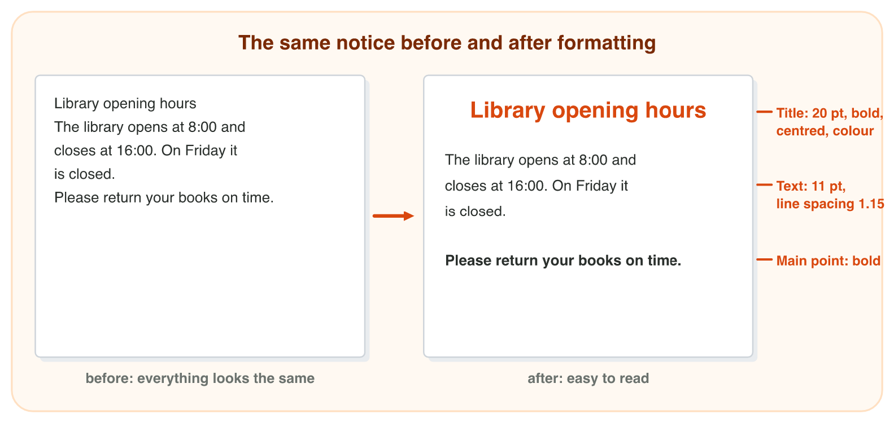
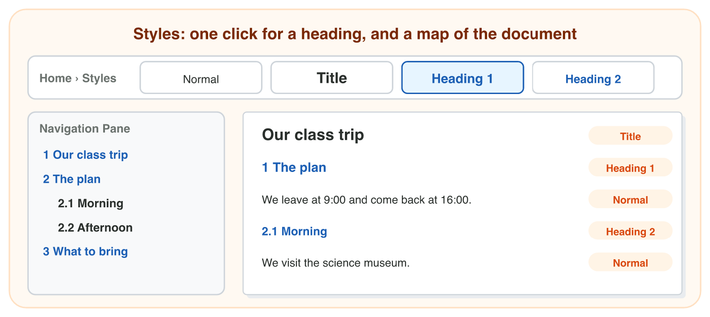
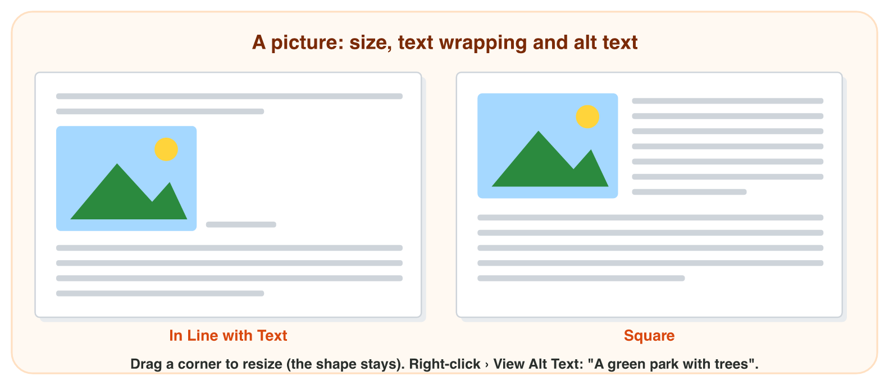
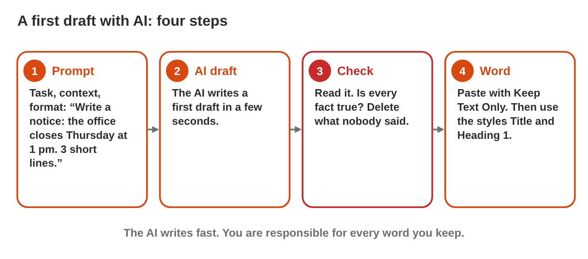

## Keywords



## Make text easy to read: formatting

:::: {.columns}
::: {.column width="50%"}
- Text formatting changes the font, the size, bold and the colour: Home › Font.
- You select the text first, and only the selection changes.
- Paragraph formatting changes the alignment and the line spacing: Home › Paragraph.
- A click inside the paragraph is enough, and the whole paragraph changes.
:::
::: {.column width="50%"}

:::
::::

## Styles: headings with one click

:::: {.columns}
::: {.column width="50%"}
- A style is saved formatting with a name, like Title, Heading 1 or Normal.
- When you change a style once, all the text with it changes.
- View › Navigation Pane shows the headings as a map of the document.
- A heading made bold and big by hand is normal text for Word.
:::
::: {.column width="50%"}

:::
::::

## Live demo · Word Lab: styles



## Try it 1 · Which style?

a) "Our class trip" is the name of the whole report. Which style does it get?
b) "Morning" is a smaller heading under "The plan". Which style does it get?
c) You change the colour of Heading 1 once. What happens?

::: {.answer}
a) Title
b) Heading 2
c) All the Heading 1 headings change.
:::

## A table and a picture

:::: {.columns}
::: {.column width="50%"}
- A table puts information in rows and columns, and its header row names the columns.
- Insert › Pictures adds a picture, and a corner handle keeps its shape.
- With Square, the text flows around the picture.
- Alt text says what the picture shows, and a screen reader reads it aloud.
:::
::: {.column width="50%"}

:::
::::

## Live demo · Word Lab: a table



## Try it 2 · Tables and pictures

a) A price list has 6 items, each with a price, and a header row. How many rows does the table need?
b) The text must flow around the picture. Which wrapping do you choose?

::: {.answer}
a) 7
b) Square
:::

## A draft from AI, checked and proofread

:::: {.columns}
::: {.column width="50%"}
- An AI assistant writes a first draft fast, from the facts in the prompt.
- You check every line, because the AI can add a fact or change a number.
- You paste with Keep Text Only, so the styles of Word give the look.
- Spelling & Grammar finds spelling mistakes, but not a wrong fact.
:::
::: {.column width="50%"}

:::
::::

## Live demo · Word Lab: check the AI



## Try it 3 · Check the AI

a) The AI adds "Every book costs 1 JD", and nobody said it. What do you do?
b) Which paste option takes only the words from the AI chat?
c) Does Spelling & Grammar find a wrong time in the draft?

::: {.answer}
a) Delete it.
b) Keep Text Only
c) No: only you can check the facts.
:::

## Summary

- Text formatting changes the selected text, and paragraph formatting changes the whole paragraph.
- A style is saved formatting, and a change of the style changes all its text.
- Heading styles make the Navigation Pane.
- A table has rows and columns, and Square wrapping lets the text flow around a picture.
- An AI draft is fast, but you check every fact and number before you use it.

## Your worksheet

:::: {.columns}
::: {.column width="50%"}
- In the computer lab, follow the worksheet alone, step by step, in Word.
- Six short tasks: type the notice, styles, Center, Bold, a table, a text from AI, save.
- Nothing to download: you type the text yourself.
- Each step has a picture of the screen; tick each step when it is done.
:::
::: {.column width="50%"}

:::
::::

## Results of the worksheet

What does your notice show at the end?

::: {.reveal}
- Tasks 1–3: Book Fair is a Title in the center, the pane shows the headings, and only the word free is bold and red.
- Task 4: The price table has 2 columns and 4 rows.
- Tasks 5–6: Line B says 15:00, the 1 JD line is not there, students has no red line, and the file is on the Desktop.
:::

## Game challenge · The Family Day notice



## Try it 4 · Huda's notice (harder)

The facts: the notice has the title "Sunrise Family Day", the headings "The plan" and "What to bring", three things to bring, a bus plan with four times and a park picture.

a) How many rows does the table of the bus plan need with a header row?
b) Huda made "The plan" bold and big by hand. Why is it not in the Navigation Pane?
c) Which alt text is good for the park picture?

::: {.answer}
a) 5 rows (and 2 columns)
b) It has no heading style, so Word sees normal text.
c) for example: "A green park with trees"
:::
